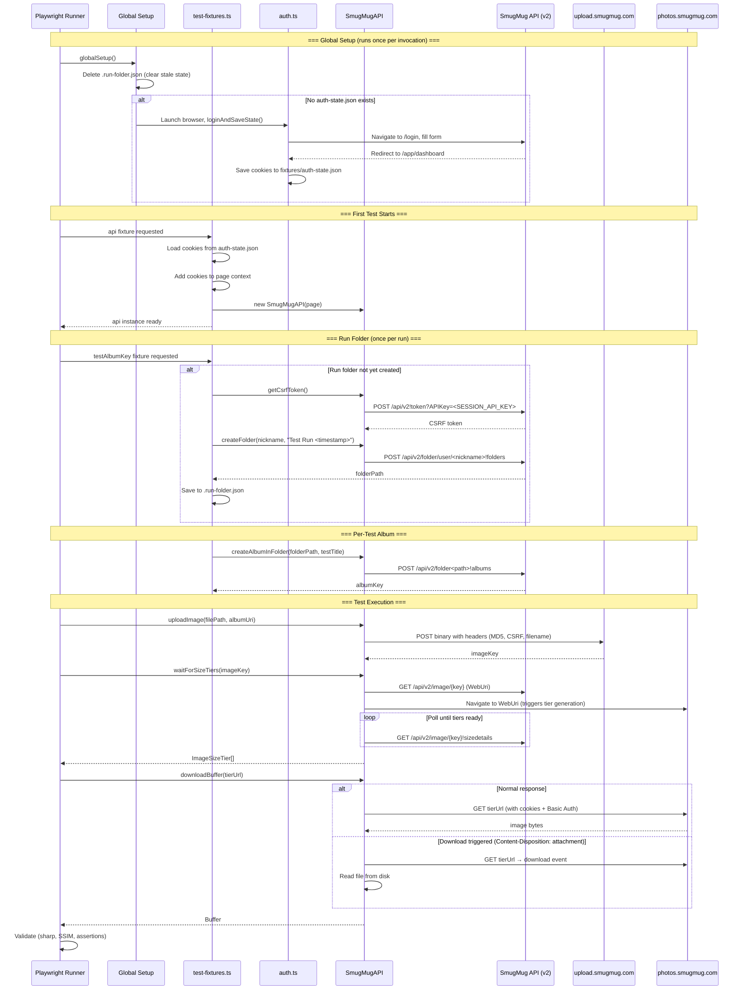

# Test Architecture & Sequence Diagram

## Test Run Flow



## Authentication Model

```
┌─────────────────────────────────────────────────────────────────┐
│ Environment Selection (ENVIRONMENT env var)                       │
├─────────────────────────────────────────────────────────────────┤
│                                                                  │
│  INSIDE                          PRODUCTION                      │
│  ├─ HTTP Basic Auth              ├─ No Basic Auth                │
│  │  (INSIDE_AUTH_USER/PASS)      │                               │
│  ├─ API Key                      ├─ API Key                      │
│  │  (SMUGMUG_API_KEY_INSIDE)     │  (SMUGMUG_API_KEY_PRODUCTION) │
│  ├─ Session cookies              ├─ Session cookies               │
│  │  (from browser login)         │  (from browser login)          │
│  └─ CSRF token                   └─ CSRF token                   │
│     (per SmugMugAPI instance)       (per SmugMugAPI instance)    │
│                                                                  │
└─────────────────────────────────────────────────────────────────┘
```

## Test Projects

```
┌─────────────────────────────────────────────────────────────────┐
│ playwright.config.ts                                             │
├─────────────────────────────────────────────────────────────────┤
│                                                                  │
│  api-tests (36 tests)                                            │
│  ├─ color-accuracy.spec.ts (10) — Delta-E color validation       │
│  └─ image-render.spec.ts (26) — visual screenshot baselines      │
│                                                                  │
│  smugmug-api-tests (66 tests)                                    │
│  ├─ api-exif-orientation.spec.ts (12)                            │
│  ├─ api-image-quality.spec.ts (8)                                │
│  ├─ api-image-sizing.spec.ts (11)                                │
│  ├─ api-metadata-api.spec.ts (7)                                 │
│  ├─ api-metadata-preservation.spec.ts (14)                       │
│  ├─ api-point-of-interest.spec.ts (5) — DISABLED                 │
│  ├─ api-resolution-cap.spec.ts (4)                               │
│  ├─ api-text-overlay.spec.ts (5)                                 │
│  └─ api-watermark.spec.ts (5)                                    │
│                                                                  │
│  smugmug-ui-tests (9 tests)                                      │
│  └─ api-metadata-display.spec.ts (9)                             │
│                                                                  │
│  ui-tests — DISABLED (redundant with smugmug-ui-tests)           │
│                                                                  │
└─────────────────────────────────────────────────────────────────┘
```

## Key Architecture Decisions

1. **One folder per run** — All tests share a single folder, each gets its own album. Reduces API calls from 73 to 1 folder creation.

2. **Session persistence** — Login happens once in globalSetup, cookies saved to `fixtures/auth-state.json`, reused by all tests.

3. **Run folder persistence** — Folder path saved to `test-results/.run-folder.json` so it survives across test files within the same worker.

4. **Visitor testing** — Tests that verify visitor behavior (MD-06/07/08, RC-01/04, WM-01/04/05) open a separate browser context without login cookies.

5. **Download handling** — `downloadBuffer()` handles both inline responses and `Content-Disposition: attachment` (archived originals, GIFs) via Playwright's download event.

6. **API key per environment** — `SMUGMUG_API_KEY_INSIDE` and `SMUGMUG_API_KEY_PRODUCTION` in `.env`, selected automatically based on `ENVIRONMENT`.

## File Structure

```
helpers/
├── auth.ts              — Login flow, session save/restore
├── exif-utils.ts        — EXIF parsing utilities
├── gallery-images.ts    — Baseline gallery image fetcher (local tests)
├── global-setup.ts      — Pre-run login + state cleanup
├── image-comparison.ts  — SSIM, pixel comparison utilities
├── index.ts             — Barrel exports
├── smugmug-api.ts       — SmugMug API v2 client (upload, download, CRUD)
└── test-fixtures.ts     — Playwright fixtures (api, testAlbumKey, etc.)

tests/
├── api-*.spec.ts        — SmugMug API tests (upload + verify)
├── color-accuracy.spec.ts — Local color validation
├── image-render.spec.ts — Local screenshot baselines
└── baselines/           — Saved screenshot PNGs for render tests

docs/
├── image-usage.csv      — Which test images are used by which tests
├── skipped-tests.md     — Disabled/skipped tests with reasons
├── test-inventory.csv   — All tests with status and confidence
├── test-sequence-diagram.md — This file
└── test-steps.md        — Detailed step-by-step for each test
```
