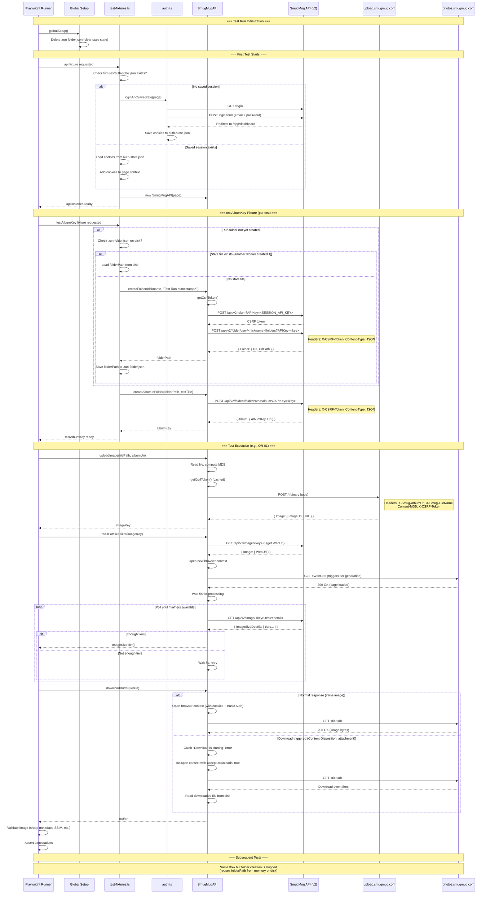

# API Test Sequence Diagram

## Key Points

1. **One folder per run** — Created by the first test, persisted to `.run-folder.json`, reused by all subsequent tests
2. **One album per test** — Each test gets its own gallery inside the shared folder
3. **Session reuse** — Login happens once, cookies saved to `auth-state.json`
4. **CSRF token** — Acquired once per `SmugMugAPI` instance, cached for all write operations
5. **API key selection** — `SESSION_API_KEY` reads from `SMUGMUG_API_KEY_PRODUCTION` or `SMUGMUG_API_KEY_INSIDE` based on `ENVIRONMENT`
6. **Tier generation** — Triggered by navigating to the image's WebUri in a browser (SmugMug generates tiers on demand)
7. **Download handling** — Two paths: inline response (normal images) or download event (archived originals, GIFs)
